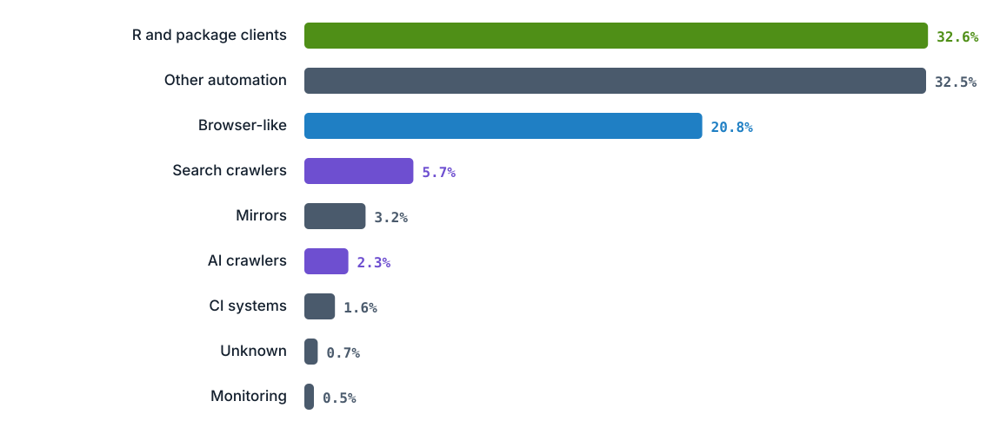
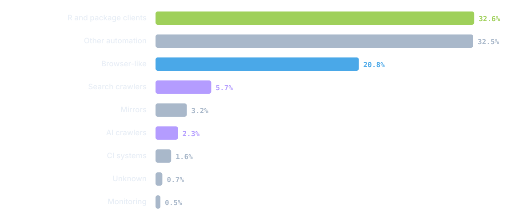
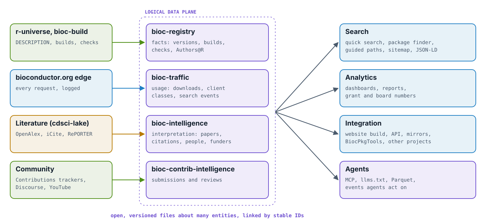
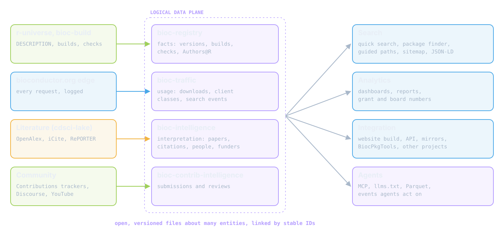
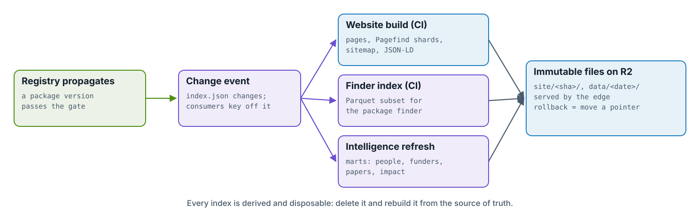
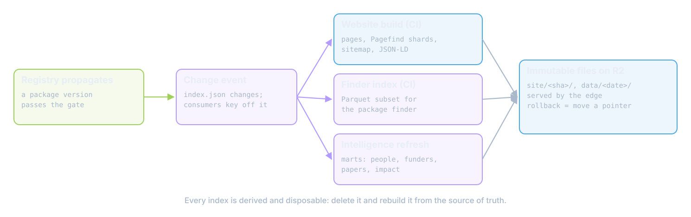
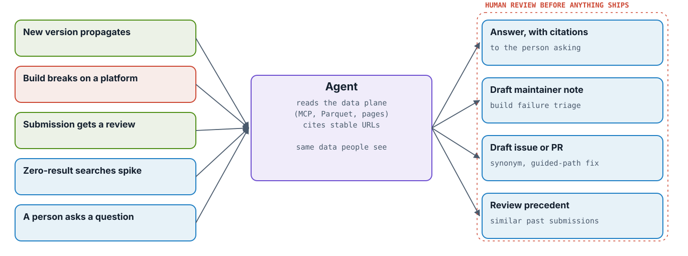
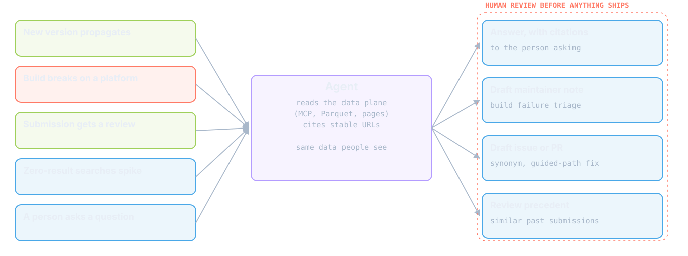
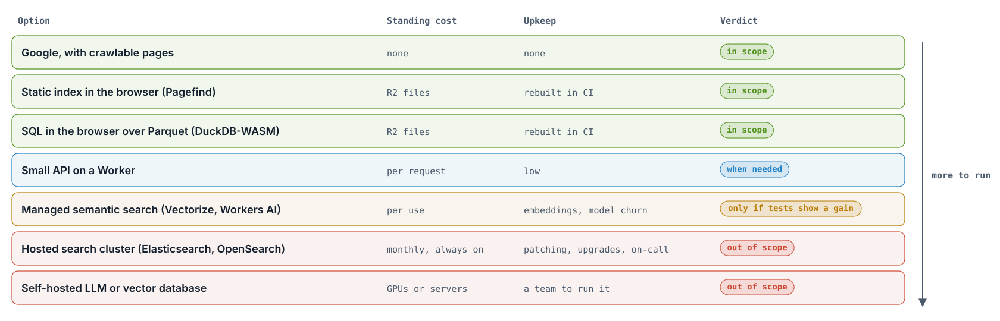
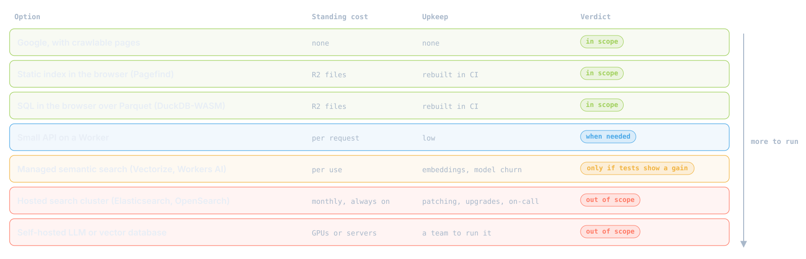

::: {.callout-note}
## Status: proposal, under discussion (2026-10-02)
A proposal for delivering the unified search funded by CZI's Essential Open Source Software
program (EOSS cycle 6, *Supporting and Sustaining Bioconductor Developers*, funded in 2024).
None of the search work in that grant has been built yet. This page proposes a rescope based on
what exists now. Nothing here is decided. Counts are from 2026-10-02 unless another date is
given.
:::

## Summary

The grant promised a unified search across bioconductor.org, the support site,
code.bioconductor.org and the YouTube channel, built on a hosted search engine with a public
API. Three of those four platforms have changed since it was written:

- **The support site** is being replaced by a new Discourse site.
- **code.bioconductor.org** is down: its certificate expired on 2026-08-30.
- **bioconductor.org** moved to a static build on Cloudflare in September 2026.

The original plan was mostly about collecting data: scrapers feeding one index. Most of that
data now exists, or has an obvious home, in the modules built for the migration. What nobody
has built is the hard part: retrieval quality and the experiences people actually use.

The proposal:

1. **Sustainability first.** Anything that needs significant or costly infrastructure to run is
   out of scope (@fig-cost-ladder).
2. **The data plane is logical.** It is a set of open, versioned files, each owned by one
   producer and joined on the package (@fig-data-plane). It serves search, analytics,
   integration and agents equally. It is not a database and not a search cluster.
3. **Agents are first-class users,** and with human review, contributors. Machines already make
   most requests to bioconductor.org (@fig-traffic-mix).
4. **Search is several focused experiences,** each matched to a persona (@tbl-experiences).
   General web search is left to Google, once the site stops blocking it.
5. **Retrieval quality is measured** against a versioned test set before and after every
   ranking change.
6. **New sources and new functions plug in** without changing what exists: a new producer
   publishes files under the same contract, and a new tool, skill or agent procedure reads them
   ([Extending it](#extending-it)).

## Guiding principles

::: {.callout-important}
## Sustainability and maintainability come first
Bioconductor's infrastructure is run by a very small team on grant and volunteer time, and the
project moved off its servers in 2026 precisely because they were costly to run and impossible
for anyone else to take over. A search that needs its own servers would recreate that problem.
So every component must:

- **run from static files or pay-per-use serverless,** with no standing bill and nothing to
  patch;
- **be rebuildable from its sources** by CI, so losing it costs a rebuild, not a recovery;
- **be documented and tested** where a newcomer, or an agent, can find it;
- **justify itself against a measurement,** not an expectation.

When in doubt, leave it out. A missing feature can be added later; a running service has to be
paid for and operated indefinitely.
:::

**The data plane is logical.** "Data plane" means the contract, not a system: each producer
publishes its slice as open, versioned files, and consumers join them on the package name.
bioc-registry owns facts with fixed definitions (versions, builds, checks, DESCRIPTION
fields); bioc-intelligence owns interpretation (publications, citations, people, funders);
bioc-traffic owns usage. Search is one consumer among several. The same files feed dashboards,
grant and board reports, mirrors, other projects, and agents. Nothing in this proposal adds a
central database.

**Agents are first-class.** People increasingly find and use software through AI assistants,
and the project's own maintenance increasingly runs through agents. Both need the same things
search needs: stable URLs, pages that render without JavaScript, structured metadata, and bulk
data with documented schemas. Designing for agents is designing for search. See
[Agents](#agents).

**Indexes are derived.** Every index, whether a Pagefind bundle, a Parquet extract, a sitemap
or `llms.txt`, is rebuilt from the sources of truth and never edited by hand
(@fig-index-lifecycle).

**Open to extension.** The contract is small enough that adding a data source or a capability
means adding one producer or one consumer, not changing the others. See
[Extending it](#extending-it).

## What changed since the grant was written

| When the grant was written (2023) | Now (2026-10) |
|---|---|
| Site search: legacy Solr. The grant's own baseline: "edgeR" returned more than 7,500 results with no way to refine them | Solr retired (`/solr` returns 404). [Pagefind](astro-site-build.qmd) runs in the browser over a static index built with the site. It covers release package names, titles and descriptions, and the prose pages |
| Site on AWS servers (master, staging) | Static Astro build in R2, served by a Cloudflare Worker since 2026-09-28 ([how it works](how-it-works.qmd)) |
| support.bioconductor.org (Biostar) | Being replaced by a new Discourse site, starting from scratch |
| code.bioconductor.org (code search, devel branch only) | Certificate expired 2026-08-30; not usable |
| Package metadata spread across the build system, VIEWS and BiocPkgTools | [bioc-registry](propagation-gate.qmd) observes r-universe, gates propagation, and publishes an index plus Parquet |
| Funding to come from the Authors@R `fnd` role | Only 146 of 3,790 packages declare `fnd`. Publication-linked grants already cover more ([below](#funding-data)) |
| LLMs as an optional component | AI assistants and crawlers are regular clients of the site (@fig-traffic-mix) |
| No search analytics | Every request is logged ([ADR 0003](adr/0003-request-logging-after-the-cloudflare-cutover.md)). Queries typed into the Pagefind box are not |

: How the ground has shifted since the grant was written. Left: the assumptions in the 2023
application and its 2024 requirements draft. Right: the state on 2026-10-02, with links to the
pages that own each fact. {#tbl-changes}

## Who uses the site

::: {#fig-traffic-mix}
::: {.light-content}
{fig-alt="Requests by client type on 2026-09-30: R and package clients 32.6%, other automation 32.5%, browser-like 20.8%, search crawlers 5.7%, mirrors 3.2%, AI crawlers 2.3%, CI 1.6%, unknown 0.7%, monitoring 0.5%."}
:::
::: {.dark-content}
{fig-alt="Requests by client type on 2026-09-30: R and package clients 32.6%, other automation 32.5%, browser-like 20.8%, search crawlers 5.7%, mirrors 3.2%, AI crawlers 2.3%, CI 1.6%, unknown 0.7%, monitoring 0.5%."}
:::

Requests to bioconductor.org and www by client type over one UTC day (2026-09-30, 5.8 million
requests), using bioc-traffic's first (v0) classification. Green: R installs; blue:
browser-like clients, which claim to be browsers and are not a count of people; violet: search
and AI crawlers; grey: other machines. Source and caveats: [One day of
traffic](traffic-2026-09-30.qmd).
:::

At most a fifth of requests even claim to come from a browser. Search crawlers and AI crawlers
together make 8% of requests, and they are how most people will reach a package page. Whatever
the project builds for search has to work for them first.

## What exists today

None of these modules was built under the grant. They are what a search effort would build on.

| Module | Holds or does | Runs on | Search-relevant role today | Gap for search |
|---|---|---|---|---|
| [bioc-registry](https://github.com/seandavi/bioc-registry) | Observes r-universe; the propagation gate; `index.json` with versions, DESCRIPTION fields, vignettes and commits; check history as Parquet; SQL in the browser | Worker + R2 | Source of truth for package facts; the trigger for re-indexing | Software universes only; drops `Authors@R` ([bioc-registry#63](https://github.com/seandavi/bioc-registry/issues/63)) |
| [bioc-website](https://github.com/seandavi/bioc-website) | Renders package data and prose into static pages; builds the Pagefind index | GitHub Actions → R2 | Site search, package pages | No robots.txt, sitemap, canonical links or structured data of its own ([#33](https://github.com/seandavi/bioc-website/issues/33)–[#36](https://github.com/seandavi/bioc-website/issues/36)); vignette text not indexed |
| [bioc-edge](https://github.com/seandavi/bioc-edge) | The Worker serving bioconductor.org: routes, redirects, logging | Worker + R2 | Serves everything; can host small endpoints | Duplicate URLs, crawler headers ([bioc-edge#55](https://github.com/seandavi/bioc-edge/issues/55)) |
| [bioc-traffic](https://github.com/seandavi/bioc-traffic) | Request logs since 2020, client classes, download statistics | Batch job + private R2 | Popularity signals; header-form search queries are in the logs | No events from the Pagefind box; statistics not yet published |
| [bioc-intelligence](https://github.com/seandavi/bioc-intelligence) | 3,810 packages: biocViews, downloads, describing publications (961 packages), citations, NIH grants (613 grants, 265 packages) | Monthly batch job; static dashboard | Publications, impact and funding; dashboards | No people, ORCID or `fnd` ([bioc-intelligence#23](https://github.com/seandavi/bioc-intelligence/issues/23)); NIH funders only |
| bioc-contrib-intelligence | Issues and timelines from the package-submission trackers | Batch job | Review history and precedent | Not package repositories |
| [bioc-build](https://github.com/seandavi/bioc-build), [bioc-manifest](https://github.com/seandavi/bioc-manifest) | Builds the data and workflow packages r-universe can't | GitHub Actions | Feeds the registry for non-software packages | Proof of concept |
| Discourse (new support site) | Questions and answers | Hosted, not by this project | Its own search, JSON API, crawlable | Whether the Biostar archive is imported is undecided |

: The modules a search effort would build on, as of 2026-10-02. "Runs on" shows where each one
costs money or attention. Two batch jobs (bioc-traffic, bioc-intelligence) run on a project
host because they read a private data lake; nothing in this proposal adds another.
{#tbl-modules}

### The data plane

::: {#fig-data-plane}
::: {.light-content}
{fig-alt="Four sources feed four producers in a logical data plane: r-universe and bioc-build into bioc-registry, the bioconductor.org edge into bioc-traffic, literature via cdsci-lake into bioc-intelligence, community sites into bioc-contrib-intelligence. The plane publishes open, versioned files joined on the package, read by search, analytics, integration and agents."}
:::
::: {.dark-content}
{fig-alt="Four sources feed four producers in a logical data plane: r-universe and bioc-build into bioc-registry, the bioconductor.org edge into bioc-traffic, literature via cdsci-lake into bioc-intelligence, community sites into bioc-contrib-intelligence. The plane publishes open, versioned files joined on the package, read by search, analytics, integration and agents."}
:::

The logical data plane. Left: sources (green: builds and community; blue: the edge; amber:
external literature). Centre, violet: four producers, each owning one slice and publishing it
as files. Right: consumers. Search is one of four kinds, and agents read the same files as
everything else. Adapted from the "One data layer" slide in the
[2026-10-01 Technical Advisory Board talk](https://talks.seandavis.net/2026-10-01-bioc-tab/).
:::

| Entity | Source of truth | Produced by | Published as | Main consumers |
|---|---|---|---|---|
| Package (name, version, title, description, biocViews, dependencies) | DESCRIPTION via r-universe or bioc-build | bioc-registry | `index.json`, Parquet | Website build, package finder, intelligence, agents |
| Build and check status | r-universe and bioc-build results | bioc-registry | Parquet, `/next/` pages | Package pages, maintainers, agents |
| Vignettes (list and titles) | r-universe metadata | bioc-registry → bioc-website | Page data | Site search, sitemap, guided paths |
| Vignette full text | Built vignette HTML | New: indexed at site build | Pagefind bundle | Quick search, guided paths |
| People (authors, maintainers, roles, ORCID) | `Authors@R` | bioc-registry keeps it; bioc-intelligence parses it | Parquet | Package finder, profiles, dashboards, JSON-LD |
| Funders | `fnd` role; acknowledgements on linked publications | bioc-intelligence | Parquet | Dashboards, package pages |
| Publications and citations | CITATION and DOI → OpenAlex, iCite | bioc-intelligence | Parquet | Package pages, researchers |
| Usage | Edge logs | bioc-traffic | Aggregated Parquet, no client addresses | Ranking tiebreaks, dashboards |
| Support questions and answers | Discourse | Discourse | Its own search and API | Linked from site search and package pages |
| Videos | YouTube channel | New, small: a curated index | Static JSON | Guided paths, package pages |
| Code search | none | Out of scope until code.bioconductor.org has an owner | | |

: Where each entity lives in the data plane. Target state: today bioc-website still reads
r-universe and package tarballs directly rather than through the registry. Rows marked "New"
are the only new producers this proposal adds. {#tbl-entities}

### How indexes stay current

::: {#fig-index-lifecycle}
::: {.light-content}
{fig-alt="A registry propagation is the event; CI rebuilds the website (pages, Pagefind shards, sitemap, JSON-LD) and the package finder's Parquet, and bioc-intelligence refreshes its marts. Everything lands as immutable files on R2 served by the edge; rollback moves a pointer."}
:::
::: {.dark-content}
{fig-alt="A registry propagation is the event; CI rebuilds the website (pages, Pagefind shards, sitemap, JSON-LD) and the package finder's Parquet, and bioc-intelligence refreshes its marts. Everything lands as immutable files on R2 served by the edge; rollback moves a pointer."}
:::

Index lifecycle. A propagation in bioc-registry (green) is the event every consumer keys off.
CI rebuilds the site and its indexes (blue); the finder extract and intelligence marts (violet)
refresh from the same event. The outputs are immutable files on R2, so rolling back is moving a
pointer, as it already is for the [site build](how-it-works.qmd). Nothing scrapes
bioconductor.org.
:::

## Personas

The requirements draft listed 31 user stories, nearly all built around one package (DESeq2) and
one maintainer. Most of them are lookups and reports, like "show the download statistics for
DESeq2" or "list developers with more than five packages". They don't say what people are
trying to do, or where they start. @tbl-personas replaces them with personas. The next step is
to write two or three concrete tasks per persona, each a starting query plus the answer an
expert would accept. Those tasks become the retrieval test set ([I1](#invariants)). The
personas written for the agent harnesses in
[bioc-harnesses](https://github.com/seandavi/bioc-harnesses) (maintainers, analysts, core team)
are a starting point for the developer and analyst rows.

| Persona | Trying to | Example needs | Best surface | Data exists? |
|---|---|---|---|---|
| New user (biologist or analyst) | Get from a data type to a working analysis | "I have bulk RNA-seq counts, what do I use?"; "how do I install?"; "convert gene symbols to Entrez IDs" | Google, then guided paths and vignettes | Packages and vignettes yes; curated paths no |
| Single-cell user | Assemble a workflow across many packages | "Which packages do QC, normalization and clustering for scRNA-seq?" | Guided path built on OSCA and biocViews; package finder | Yes; path curation no |
| Package user with a problem | Fix an error, understand a method | "DESeq2: every gene contains at least one zero"; "how does limma handle batch effects?" | Google, Discourse, vignette full text | Discourse yes; vignette text not indexed |
| Developer or maintainer | Build and maintain packages | "Who else implements X?"; "what depends on my package?"; "why is my build red?" | Package finder (reverse dependencies, biocViews); build pages; contributions guide | Yes (registry) |
| Prospective contributor (from Python, tidyverse) | Find where they fit | "Which packages work with AnnData and scverse?"; "who maintains this ecosystem?" | Package finder and people profiles | Packages yes; people pending |
| Open-source software researcher | Study the ecosystem | Dependency networks, maintainer load, citation and funding patterns, growth | Documented Parquet; SQL in the browser | Mostly yes |
| Bioconductor leader (core team, boards) | Steward the project | "Which funders support our packages?"; "which high-impact packages have one maintainer?" | Dashboards | Publications and NIH yes; people and other funders pending |
| Educator | Find teaching material | Videos, workshops and books on a topic | Guided paths; video index | Books yes; videos not indexed |
| AI agent, for any of the above | Answer accurately, act on events | Current APIs, which package to use, why a build failed, how a submission compares | Crawlable pages, JSON-LD, `llms.txt`, Parquet, MCP | Partly; structured data pending |

: Personas, what they are trying to do, and which surface serves them. "Best surface" is where
the persona should land first, not the only place they can. The last column shows whether the
data plane already holds what that surface needs. {#tbl-personas}

## Search experiences

| Experience | Serves | How | Cost model |
|---|---|---|---|
| Google and other engines | Everyone, long-tail questions | Unblock crawling, a real sitemap, canonical links, structured data ([bioc-website#33–36](https://github.com/seandavi/bioc-website/issues/33), [bioc-edge#55](https://github.com/seandavi/bioc-edge/issues/55)) | None |
| Quick site search | People who start on bioconductor.org | Pagefind, adding vignette full text, type badges, and separate bundles per surface merged in the browser | Static |
| Package finder | Developers, single-cell users, contributors | Facets (biocViews, repository, maintainer, ORCID, build status, reverse dependencies) over registry and intelligence Parquet, queried in the browser | Static + browser |
| Guided paths | New and domain users, educators | Curated pages per data type or task, kept as versioned files with named maintainers and CI checks against the registry | Static |
| Support | People with a problem | Discourse's own search; site search links out with the query filled in; package pages show recent topics | Discourse's |
| Data and agent access | Researchers, tool builders, agents | Documented Parquet, `llms.txt`, JSON-LD, and an MCP server over the same files if demand appears | Static + Worker |
| Dashboards | Leaders, researchers | The bioc-intelligence dashboard, extended with people and funders | Static + browser |

: The search experiences, each matched to the personas in @tbl-personas. "Cost model" is the
standing cost of running it: "Static" means files on R2 rebuilt by CI; "browser" means the
reader's machine does the work. {#tbl-experiences}

## Agents

::: {#fig-agents-loop}
::: {.light-content}
{fig-alt="Events from the data plane (a version propagates, a build breaks, a submission is reviewed, zero-result searches spike, a person asks a question) reach an agent that reads the same data people see and cites stable URLs. It produces answers with citations, draft maintainer notes, draft issues or pull requests, and review precedent, all behind human review."}
:::
::: {.dark-content}
{fig-alt="Events from the data plane (a version propagates, a build breaks, a submission is reviewed, zero-result searches spike, a person asks a question) reach an agent that reads the same data people see and cites stable URLs. It produces answers with citations, draft maintainer notes, draft issues or pull requests, and review precedent, all behind human review."}
:::

Agents in the loop. Left: events the data plane already produces or could produce (coral: a
failure). Centre: an agent reading the data plane through the same files and pages people use.
Right: what it produces. Everything that would change the project passes human review first
(dashed coral boundary).
:::

Agents matter to this proposal in three ways.

- **As readers.** Assistants answer questions about Bioconductor every day, from whatever they
  can crawl. Crawlable pages, JSON-LD, `llms.txt` and Markdown twins of pages (this site
  already publishes [`llms.txt`](https://seandavi.github.io/bioc-infrastructure/llms.txt)
  that way) decide whether those answers are current and correct. This is the cheapest search
  investment with the widest reach.
- **As actors.** The data plane emits events: a version propagates, a build breaks on one
  platform, a submission gets a review, zero-result searches spike. An agent subscribed to
  them can draft a note to a maintainer, triage a failure, suggest a synonym or a fix to a
  guided path, or find precedent for a submission. Answers must cite their sources ([I12](#invariants)),
  and anything that changes the project goes through human review.
- **As maintainers.** The modules in @tbl-modules were built and are maintained with agents.
  That only works because each one is small, documented, tested and rebuildable. The
  sustainability rules above are also what makes agent maintenance safe. A hosted search cluster
  is exactly the kind of system an agent can't safely operate.

## Extending it {#extending-it}

Search is the first consumer of the data plane, not the last. The design has to make it cheap
to add both new data and new capabilities.

**A new data source** (the Discourse site, workshop materials, Hub resources, conference
talks) joins by publishing files under the same contract as the existing producers. It
needs:

- **an owner,** meaning one repo and one maintainer;
- **a join key** on the package, plus a stable identifier for its own records;
- **a documented schema** with dated snapshots and a `latest` alias;
- **a rebuild** from its own source of truth, run by CI or a scheduled serverless job;
- **no private data** in the published files.

Nothing downstream has to change for the source to exist. Each consumer opts in when it's
useful.

**A new capability** is a new consumer of those files. Besides interfaces for people, the
capabilities with the most leverage are for agents:

- **[Bioconductor's AI agent skills](https://github.com/Bioconductor/ai-agent-skills)** teach
  coding agents the project's conventions and workflows.
- **Agentic standard operating procedures (SOPs)** behind those skills turn recurring work into
  written, reviewable steps. Examples: triaging a build failure, pre-reviewing a submission,
  refreshing a guided path when a package is deprecated, answering a support question with
  citations.
- **Harnesses** like [bioc-harnesses](https://github.com/seandavi/bioc-harnesses) package the
  skills and procedures for maintainers, analysts and the core team.

All of these read the data plane through the same files, pages and (if built) MCP server.
They are triggered by the same events (@fig-agents-loop), and their output goes through the
same human review.

That gives the data plane a single, stable job: be the dependable, documented ground truth
that people, tools, skills and agents all build on. A skill or SOP needs current package
facts, build state, usage and literature. With the data plane in place, it can get them by
reading files instead of scraping websites.

## Sustainability and cost

::: {#fig-cost-ladder}
::: {.light-content}
{fig-alt="Options from least to most to run: Google with crawlable pages; a static Pagefind index; SQL in the browser over Parquet; a small Worker API; managed semantic search; a hosted Elasticsearch or OpenSearch cluster; a self-hosted LLM or vector database. The first three are in scope, a Worker API when needed, managed semantic search only if tests show a gain, and the last two are out of scope."}
:::
::: {.dark-content}
{fig-alt="Options from least to most to run: Google with crawlable pages; a static Pagefind index; SQL in the browser over Parquet; a small Worker API; managed semantic search; a hosted Elasticsearch or OpenSearch cluster; a self-hosted LLM or vector database. The first three are in scope, a Worker API when needed, managed semantic search only if tests show a gain, and the last two are out of scope."}
:::

The cost and upkeep ladder, qualitative. Each row is a way to deliver part of search, ordered
from least to most to run. "Standing cost" is what it costs when nobody is using it; "Upkeep"
is the work that comes back every month. Green: in scope; blue: when a need is shown; amber:
only if the test set shows a gain; coral: out of scope.
:::

The new stack serves bioconductor.org for roughly $240–500 a month, against about $5,000 for
the AWS estate it replaces ([costs](improvements.qmd)). A managed search cluster would add a
standing monthly bill of its own, plus patching, upgrades and someone on call. It would do
that for a site whose search traffic Pagefind already handles from static files. The original
plan's hosted engine and public API are the main things this proposal drops.

Two operational risks are known for the static approach:

- **DuckDB-WASM range reads.** Newer versions of DuckDB-WASM have been reported to download
  whole remote Parquet files instead of byte ranges
  ([duckdb-wasm discussion #2247](https://github.com/duckdb/duckdb-wasm/discussions/2247)).
  Pin the version, and add a CI check on bytes transferred.
- **Pagefind size.** Pagefind loads only the index chunks a query needs. Its documentation cites
  about 300 kB of payload for a 10,000-page site
  ([pagefind.app](https://pagefind.app/)). Adding vignette full text will grow the index, so
  measure that before and after.

## Invariants {#invariants}

Rules that should hold whichever engine or interface is chosen. Each one comes from a source we
read on 2026-10-02.

| # | Invariant | Why | Source |
|---|---|---|---|
| I1 | Judge search against written-down information needs in a fixed, versioned test set; tune on a separate set | Relevance is judged against the need, not the query; tuning on the reported set overstates quality | [IIR ch. 8](https://nlp.stanford.edu/IR-book/html/htmledition/information-retrieval-system-evaluation-1.html) |
| I2 | Query logs are an evaluation input: track zero-result queries and reformulations | The most overlooked source of search problems; fixes are synonyms and "best bets" | [NN/g](https://www.nngroup.com/articles/search-log-analysis/) |
| I3 | An index is derived: rebuilt from the sources of truth, never edited, stamped with its inputs | Fixes belong upstream; a lost index costs a rebuild | [Pagefind](https://pagefind.app/docs/), [crates.io policy](https://rust-lang.github.io/rfcs/3463-crates-io-policy-update.html) |
| I4 | Publish bulk, static, versioned files first; every interface is a consumer of them | crates.io points heavy users at a daily dump and rate-limits its API; R2 egress is free | [crates.io policy](https://rust-lang.github.io/rfcs/3463-crates-io-policy-update.html), [R2 pricing](https://developers.cloudflare.com/r2/pricing/) |
| I5 | Facets need controlled, consistently assigned metadata, generated from the data, not hand-tagged | Faceted navigation fails when labels are inconsistent or don't match how people think | [Hearst, *Search User Interfaces* ch. 8](http://searchuserinterfaces.com/book/sui_ch8_navigation_and_search.html) |
| I6 | Start with a lexical (BM25-class) baseline; add semantic or hybrid retrieval only for a measured gain | Across 18 datasets, BM25 is a robust baseline; better re-rankers cost much more | [BEIR](https://arxiv.org/abs/2104.08663) |
| I7 | Rank an exact name match first, then text relevance, then popularity as a tiebreaker; publish the signals | How crates.io, npm and r-universe rank packages | [crates.io search](https://github.com/rust-lang/crates.io/blob/main/src/controllers/krate/search.rs), [r-universe](https://docs.r-universe.dev/browse/search.html) |
| I8 | Curated guides are data with an owner, a date and automated checks | CRAN Task Views: named maintainers, versioned, CI-checked against CRAN | [CRAN Task Views](https://github.com/cran-task-views/ctv/blob/main/Documentation.md) |
| I9 | Every result shows why it matched: title, a snippet around the matched terms, its type | Query-biased snippets beat lead sentences; people choose results by their "scent" | [Hearst ch. 5](http://searchuserinterfaces.com/book/sui_ch5_retrieval_results.html), [NN/g](https://www.nngroup.com/articles/information-scent/) |
| I10 | Search never dead-ends: zero results say so and offer next steps; facets never lead to empty sets | No-results pages drive abandonment | [NN/g](https://www.nngroup.com/articles/search-no-results-serp/) |
| I11 | One stable, canonical, pre-rendered URL per entity, linked with plain `<a href>` | Crawlers can't follow fragment URLs; canonical links consolidate duplicates | [Google: canonicals](https://developers.google.com/search/docs/crawling-indexing/consolidate-duplicate-urls), [Cool URIs](https://www.w3.org/Provider/Style/URI) |
| I12 | Generated answers cite retrievable sources; source text stays the primary artifact | The best models lacked full citation support about half the time | [ALCE](https://arxiv.org/abs/2305.14627) |
| I13 | Machine-readable metadata (JSON-LD, sitemap, `llms.txt`) is generated from the same records as the visible page | Google ignores markup for content that isn't on the page, and `lastmod` that isn't accurate | [Google: structured data](https://developers.google.com/search/docs/appearance/structured-data/intro-structured-data), [llms.txt](https://llmstxt.org/) |
| I14 | Running cost scales with content, not with traffic | Static indexes and free egress make a traffic spike cost nothing extra | [Pagefind](https://pagefind.app/), [R2 pricing](https://developers.cloudflare.com/r2/pricing/) |
| I15 | Log queries for aggregate analysis only: no addresses or user IDs, short retention, never publish raw logs | Numbering users did not keep the 2006 AOL search logs anonymous | [NYT](https://archive.nytimes.com/www.nytimes.com/learning/teachers/featured_articles/20060810thursday.html) |

: Design invariants for any Bioconductor search surface, grouped by area: evaluation (I1–I2),
data and indexes (I3–I5), ranking (I6–I8), interface (I9–I10, I12), crawlability (I11, I13),
and operations (I14–I15). The IR textbook, the Hearst book and the BEIR paper are general
references; the rest describe what specific systems do. {#tbl-invariants}

Practices to avoid, from the same sources:

- **A hosted search cluster for a low-traffic site.** Even crates.io, which runs server-side
  search, only ranks the top 1,000 candidates, because ranking every match is "prohibitively
  expensive".
- **LLM summaries in place of source text,** or answers without citations.
- **No test set,** or tuning on the set you report.
- **Content that only appears after JavaScript runs,** or deduplicating pages with robots.txt
  instead of canonical links.
- **Keeping raw addresses or user IDs in query logs.**

## Funding data

The grant planned to find funders through the Authors@R `fnd` role. That is the weakest route:

- **`fnd` declarations:** 146 of 3,790 packages (3.9%) in Bioconductor 3.24. Many name a PI
  rather than an agency, and CZI alone appears under at least five spellings.
- **Publications:** bioc-intelligence links 961 packages to a describing publication. Through
  NIH RePORTER alone, 613 NIH grants already attach to 265 packages. Most of those papers
  acknowledge grants, but only NIH links are captured so far. Adding other funders from
  publication metadata (for example OpenAlex funder records) is the larger gain.
- **What `fnd` adds:** funders a package declares but its paper doesn't acknowledge. It reaches
  bioc-intelligence through `Authors@R`
  ([bioc-registry#63](https://github.com/seandavi/bioc-registry/issues/63),
  [bioc-intelligence#23](https://github.com/seandavi/bioc-intelligence/issues/23)).

"Which packages did CZI fund?" belongs on a dashboard backed by publication funding plus `fnd`.
It isn't a search query.

## The original plan

The 2023 application and a 2024 requirements draft describe one search index fed by four
scrapers (packages, YouTube, the support site, package code), a Python API over it, an
optional external LLM, and a public API so that R users could query the index directly.
Compared with today:

- **The index and API were the plan's centre.** This proposal keeps the intent: developers can
  analyse Bioconductor data, and the website gets one search entry point. It moves that intent
  onto files and browser-side search (I4, I14).
- **Two of the four sources have moved.** The support site is moving to Discourse, and
  code.bioconductor.org has no owner. The packages source is now the registry.
- **The user stories were reports, not searches.** They are replaced by personas
  (@tbl-personas).
- **Video summaries were to be LLM-generated.** An index needs titles, descriptions and
  transcripts, not summaries (I12). Linking videos to packages by name is unreliable for
  packages named with ordinary words, so a small curated index is cheaper and more accurate.
- **No success metric or analytics were planned.** The grant's own baseline (7,500 results for
  "edgeR") becomes test case zero (I1, I2).

## Proposed sequence

1. **Crawlability:** robots.txt, sitemap, canonical links, URL normalization, structured data
   ([bioc-website#33–36](https://github.com/seandavi/bioc-website/issues/33),
   [bioc-edge#55](https://github.com/seandavi/bioc-edge/issues/55)). Small changes with the
   largest immediate effect, for people and agents alike.
2. **Data plane gaps:** `Authors@R` into the registry; people, ORCID and funders in
   bioc-intelligence; non-NIH funders from publications; registry coverage of data and
   workflow packages through bioc-build.
3. **Measure:** the persona test set; anonymous query and zero-result events from Pagefind;
   a baseline for today's Pagefind and Google.
4. **Quick search and package finder:** vignette full text in Pagefind; facets over Parquet in
   the browser.
5. **Guided paths:** start with RNA-seq and single-cell; link Discourse tags and a curated
   video index.
6. **Data and agent access:** documented Parquet, `llms.txt` for package and vignette pages,
   events, and an MCP server once the persona work shows demand.

The search design ADR on the [roadmap](roadmap.qmd) (M3) should record the decisions taken here.

## Open questions

- The award's end date, any extension, and the budget left for search.
- Will the Biostar archive be imported into Discourse? If not, years of answers drop out of
  Google and out of reach of agents.
- Does anyone own code.bioconductor.org? If not, it leaves the scope.
- Who does the interface design: grant-funded staff, a contractor, or the champions program
  the same grant funds?
